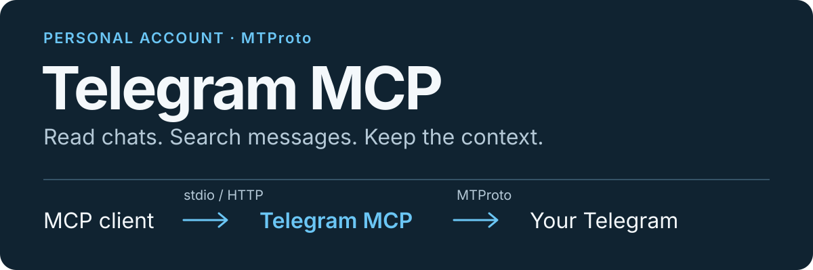

# Telegram MCP

<p align="center">
  
</p>

A Go MCP server for reading and searching conversations, groups, and channels visible to **your personal Telegram account**. Connect through stdio or authenticated HTTP; Telegram access uses MTProto, with no Bot API or bot token.

[Get started](#getting-started) · [Connect a client](#client-setup) · [HTTP hosting](#http-access) · [Tool reference](#tools) · [Configuration](#configuration)

- **Find context:** read history, search one chat or across chats, inspect replies and pinned messages.
- **Follow conversations:** browse dialogs and folders, or page through new messages with a safe `fetch_since` cursor.
- **Inspect media:** view metadata, download files, or fetch thumbnails within configured limits.

### A tool call

After setup, ask your MCP client to call `fetch_since` with these arguments:

```json
{
  "groupUrl": "@channel_username",
  "sinceId": 1234,
  "limit": 50
}
```

Replace the example chat and ID. The tool returns the earliest messages after `sinceId`; use the returned `maxId` as the next cursor. See [Tools](#tools) for all 14 tools and their limits.

**Side effects are explicit:** `mark_read` changes Telegram read state; downloads and thumbnails write local files. Other tools do not mark messages read. Sending, editing, and joining chats are unsupported.

## Getting started

Requires Go 1.26+ and an existing Telegram account; creating accounts is unsupported.

1. **Get API credentials.** At [my.telegram.org](https://my.telegram.org), sign in with your account's phone number, complete verification, and open **API development tools**. Register an application if needed, then copy **App api_id** (positive integer) and **App api_hash** (32 hexadecimal characters) to `TELEGRAM_API_ID` and `TELEGRAM_API_HASH`. Set `TELEGRAM_PHONE` to the account number with `+` and country code, e.g. `+491234567890` (placeholder).

   See the [official registration guide](https://core.telegram.org/api/obtaining_api_id). Keep credentials private; no BotFather, bot token, chat ID, or group URL is needed for setup.

2. **Load the environment.**

   ```sh
   cp .env.example .env
   chmod 600 .env
   # Set TELEGRAM_API_ID, TELEGRAM_API_HASH, and TELEGRAM_PHONE in .env.
   set -a
   . ./.env
   set +a
   ```

   Configuration is environment-only: `.env` is not loaded automatically. Source it in your shell or process manager; quote values containing spaces.

3. **Build and authorize.** Run once in an interactive terminal:

   ```sh
   go build -o bin/telegram-mcp .
   ./bin/telegram-mcp setup
   ```

   Enter the code for this attempt and, if prompted, your two-step verification (2FA) password. Input is hidden; codes and passwords are interactive inputs, never `.env` or client settings. Setup reports the delivery method: check the Telegram service chat in other sessions of the same account for in-app codes, or your phone for SMS/calls. A successful request does not prove delivery; enter SMS word/phrase codes in full.

   **No code:** enter `resend`. It requests the next method only when Telegram offers one and the displayed timeout has elapsed. Early requests show the wait without queuing a resend. With no fallback, enter the requested code or exit with Ctrl+C. Telegram controls delivery and may restrict third-party SMS or silently drop repeated requests despite reporting delivery. Repeated restarts cannot force SMS; wait before retrying. Rate limits show a retry delay and stop setup. Unsupported email verification, Firebase, or Fragment flows stop with official-client guidance. See [Telegram authorization](https://core.telegram.org/api/auth#sending-a-verification-code).

   **QR alternative:** run `./bin/telegram-mcp setup qr`, then confirm the QR token in the logged-in phone's Telegram app: Settings → Devices → Scan QR Code. Tokens refresh on expiry. Enter 2FA when prompted after scanning; otherwise login remains incomplete. QR needs no phone number or code and is unaffected by code-delivery restrictions.

   Setup creates `TELEGRAM_SESSION_PATH` (default `~/.telegram-mcp/session.json`) with `0600` permissions. This is a local session, not a portal download or generated string session. Codes and passwords are never written to configuration.

4. **Connect your client.** Use this shared `mcpServers` configuration:

   ```json
   {
     "mcpServers": {
       "telegram": {
         "command": "/absolute/path/to/telegram-mcp/bin/telegram-mcp",
         "env": {
           "TELEGRAM_API_ID": "123456",
           "TELEGRAM_API_HASH": "your_32_character_api_hash"
         }
       }
     }
   }
   ```

   Replace the path and credentials. `TELEGRAM_PHONE` is setup-only; normal startup reuses the session. Use the same OS user and, if customized, the same `TELEGRAM_SESSION_PATH` (preferably absolute). For clients without `mcpServers`, set the equivalent command and environment variables.

Without arguments, the binary starts stdio MCP. stdout is protocol-only; diagnostics and setup prompts use stderr. `--help` needs no credentials. Use one server process per session.

## Client setup

- **Local (stdio):** the client starts the binary as a child process under the OS user who ran `setup`; no token or proxy is needed.
- **Remote (HTTP):** run the server as described in [HTTP access](#http-access), then connect to `https://tg.example.com/mcp` with the bearer token.

Replace example paths, credentials, domain, and token; never commit them.

### Claude Code

Local:

```sh
claude mcp add telegram -s user \
  -e TELEGRAM_API_ID=123456 -e TELEGRAM_API_HASH=your_32_character_api_hash \
  -- /absolute/path/to/telegram-mcp/bin/telegram-mcp
```

Remote:

```sh
claude mcp add telegram -s user --transport http https://tg.example.com/mcp \
  --header "Authorization: Bearer $TELEGRAM_MCP_HTTP_TOKEN"
```

Run `/mcp` inside Claude Code to check the connection.

### Claude Desktop and claude.ai

Local: in Claude Desktop, open **Settings → Developer → Edit Config**, put the [shared JSON example](#getting-started) in `claude_desktop_config.json`, and restart.

Remote: **Customize → Connectors → Add custom connector**, URL `https://tg.example.com/mcp`, authentication **No sign-in**. Under **Request headers**, set `authorization` to `Bearer <token>` (prefix required). Anthropic's cloud must reach the URL. Request headers were beta and account-dependent when documented ([docs](https://claude.com/docs/connectors/custom/add-unlisted#authenticate-with-request-headers)); if absent, use local setup or Claude Code. Never expose the server without a token.

### ChatGPT and Codex

The documented ChatGPT developer-mode connector cannot use this server: it supports remote OAuth/no-auth servers, cannot send static bearer tokens, and cannot start local processes. Use Codex CLI or IDE extension; add one example to `~/.codex/config.toml`.

Local:

```toml
[mcp_servers.telegram]
command = "/absolute/path/to/telegram-mcp/bin/telegram-mcp"
env = { TELEGRAM_API_ID = "123456", TELEGRAM_API_HASH = "your_32_character_api_hash" }
```

Remote (the token is read from the environment variable named here, not stored in the file):

```toml
[mcp_servers.telegram]
url = "https://tg.example.com/mcp"
bearer_token_env_var = "TELEGRAM_MCP_HTTP_TOKEN"
```

Run `/mcp` inside Codex to check the connection.

### Hermes Agent

Add one of these to `~/.hermes/config.yaml`, then run `/reload-mcp`. `${VAR}` placeholders are filled in from the environment.

Local:

```yaml
mcp_servers:
  telegram:
    command: "/absolute/path/to/telegram-mcp/bin/telegram-mcp"
    env:
      TELEGRAM_API_ID: "123456"
      TELEGRAM_API_HASH: "your_32_character_api_hash"
```

Remote:

```yaml
mcp_servers:
  telegram:
    url: "https://tg.example.com/mcp"
    headers:
      Authorization: "Bearer ${TELEGRAM_MCP_HTTP_TOKEN}"
```

## HTTP access

After `setup`, `telegram-mcp http` reuses the session and serves Streamable HTTP at `http://TELEGRAM_MCP_HTTP_ADDR/mcp`:

```sh
export TELEGRAM_MCP_HTTP_TOKEN="$(openssl rand -hex 32)"   # keep it; clients need it
./bin/telegram-mcp http
# serving MCP on http://127.0.0.1:8080/mcp
```

- Require `Authorization: Bearer <TELEGRAM_MCP_HTTP_TOKEN>` on every request; otherwise `401`. Protect the token like the session: it grants all tools, including `mark_read` and downloads.
- Plain HTTP binds only to loopback (`127.0.0.1`, `[::1]`, `localhost`); `0.0.0.0` and `:8080` are refused. Publish through an HTTPS proxy on the same host.
- Downloads and thumbnails stay on the server host.
- Use a process manager, e.g. systemd with `ExecStart=/path/to/bin/telegram-mcp http` and `EnvironmentFile=`. SIGTERM stops it cleanly.

Caddy example (TLS certificates are obtained automatically):

```caddyfile
tg.example.com {
    reverse_proxy 127.0.0.1:8080 {
        header_up Host {upstream_hostport}
    }
}
```

Keep `header_up Host`: DNS-rebinding protection rejects public `Host` headers at the loopback listener with `403 Forbidden: invalid Host header`.

See [Client setup](#client-setup) for Claude, ChatGPT/Codex and Hermes.

## Configuration

The API ID/hash come from Telegram's portal; the phone belongs to your account. Paths, limits, and timeouts are local settings with usable defaults.

| Variable | Default | Purpose |
| --- | --- | --- |
| `TELEGRAM_API_ID` | Required | Positive 32-bit Telegram API ID |
| `TELEGRAM_API_HASH` | Required | 32 hexadecimal characters |
| `TELEGRAM_PHONE` | Required for `setup` (unused by `setup qr`) | Phone number with country calling code |
| `TELEGRAM_SESSION_PATH` | `~/.telegram-mcp/session.json` | gotd authorized-session file |
| `TELEGRAM_DOWNLOAD_DIR` | `~/.telegram-mcp/downloads` | Directory for downloaded files |
| `TELEGRAM_MAX_DOWNLOAD_MB` | `200` | Download limit in MiB and ceiling for `maxMB`; `0` disables the limit |
| `TELEGRAM_REQUEST_TIMEOUT` | `5m` | Total timeout for a tool call, including downloads |
| `TELEGRAM_MCP_HTTP_ADDR` | `127.0.0.1:8080` | Listen address for `telegram-mcp http`; loopback hosts only |
| `TELEGRAM_MCP_HTTP_TOKEN` | Required for `http` | Bearer token, at least 32 characters; generate with `openssl rand -hex 32` |

`~/` expands to your home; relative paths use the process working directory. Sessions hold account authorization, separate from configuration; GramJS string sessions are incompatible, so run `setup` again. Never commit `.env`, sessions, or downloads. Only `telegram-mcp http` reads HTTP settings; stdio ignores them.

## Tools

Defaults and maximums are listed below. Numeric parameters are integers; chat IDs are strings.

| Tool | Required parameters | Optional parameters |
| --- | --- | --- |
| `read_messages` | `groupUrl` | `limit`: 50, maximum 200 |
| `search_messages` | `groupUrl`, `query` | `limit`: 30, maximum 100 |
| `fetch_since` | `groupUrl`, `sinceId` | `limit`: 100, maximum 200 |
| `get_message` | `groupUrl`, `messageId` | — |
| `global_search` | `query` | `limit`: 30, maximum 100 |
| `get_group_info` | `groupUrl` | — |
| `list_dialogs` | — | `limit`: 100, maximum 500; `archived`: false |
| `list_folders` | — | — |
| `list_folder_dialogs` | `folderId` | `limit`: 100, maximum 500 |
| `get_pinned` | `groupUrl` | `limit`: 20, maximum 50 |
| `get_media_info` | `groupUrl`, `messageId` | — |
| `download_media` | `groupUrl`, `messageId` | `maxMB`: lowers the configured limit; `0` or omitted uses it |
| `get_thumbnail` | `groupUrl`, `messageId` | — |
| `mark_read` | `groupUrl` | `messageId`: marks up to and including it; omitted marks the whole chat |

### Chats and folders

`groupUrl` accepts `@username`, a bare name, `https://t.me/name`, message links (including private-channel `https://t.me/c/...`), or a numeric **ID as a string** from `list_dialogs`. IDs resolve through main and archived dialogs. Invite links are unused; the service never joins chats.

Numeric parameters must be integers. `archived=true` selects only the archive; `false` selects only the main list.

`list_folders` reports custom `folderId`s and **explicitly included** chat counts; automatic rules may add chats. Use the integer ID with `list_folder_dialogs`, e.g. `{"folderId": 2, "limit": 50}`; returned marked chat IDs work with other tools. Order: pinned, other explicit inclusions, then automatic main/archive matches; it differs from Telegram's tab order. Empty folders return explanatory text; missing IDs return errors. `list_dialogs` retains its main/archive selection.

### Messages and cursors

`read_messages`, `search_messages`, and `get_pinned` sort selected messages by ascending ID. `[album:...]` preserves the full 64-bit ID as a string; `[reply:...]` connects replies. `get_message` adds views, forwards, reactions, and reply count.

`fetch_since` returns the earliest messages after `sinceId`; use its `maxId` as the next `sinceId` until results are empty. Reaching `limit` never skips backlog.

### Media and local files

Downloads stream with declared-size and actual-byte checks. `get_thumbnail` fetches a preview up to 320 pixels per side or an embedded thumbnail, without full media. Repeated downloads create separate `0600` files; failures remove incomplete files. Both tools refuse saving-prohibited (`no-forward`) media and have MCP annotations for local-file writes. Sending and editing messages are unsupported.

### Read state

Only `mark_read` changes Telegram account state; other tools never acknowledge reads. Its per-chat cursor marks all messages through `messageId`, not individual messages. Omit `messageId` to mark through the latest message and clear manual "marked as unread". Mention/reaction badges and forum-topic read state stay unchanged. MCP annotations declare it not read-only and idempotent.

## Architecture

```text
main.go                 — Uber Fx dependency wiring, lifecycle, CLI setup
internal/config          — environment loading and validation
internal/domain          — messages, chats, folders, media; standard library only
internal/port            — outbound Telegram interface
internal/app             — use cases, validation, limits, formatting
internal/adapter/mcp     — inbound `Executor` port, MCP schemas, stdio server, and HTTP handler
internal/adapter/telegram — outbound MTProto adapter and file downloads
```

Flow: `MCP → Executor → app.Service → port.Telegram → MTProto`. Consumers own interfaces; the core has no SDK imports or environment reads. Entry-point constructors supply dependencies. Adapters use the [official Go MCP SDK](https://github.com/modelcontextprotocol/go-sdk) and [gotd/td](https://github.com/gotd/td).

## Development and checks

```sh
task build
task test
task lint
```

Without Task:

```sh
go build -o bin/telegram-mcp .
go test -race ./...
golangci-lint run ./...
```

Offline tests need no credentials or network. MCP tests cover handshake, tools, calls, validation, and errors; fake MTProto tests cover history pagination, ID-gap cursors, archives, and message/chat ownership. Separate tests cover media metadata, limits, and cleanup. Real login, API access, and account downloads require manual checks after `setup`.

## License

[MIT](LICENSE).
